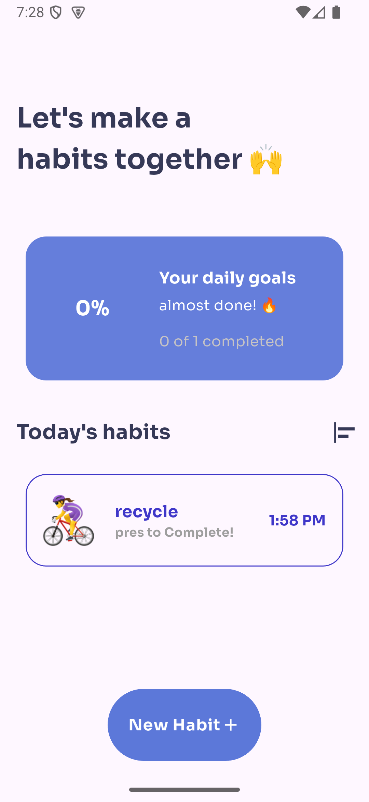
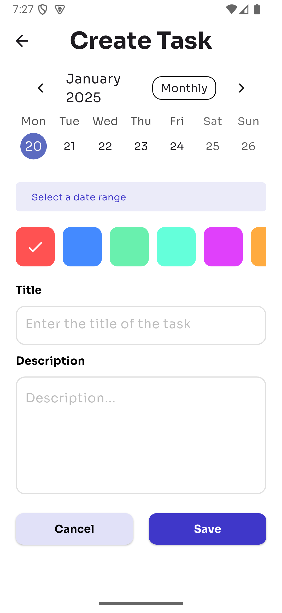
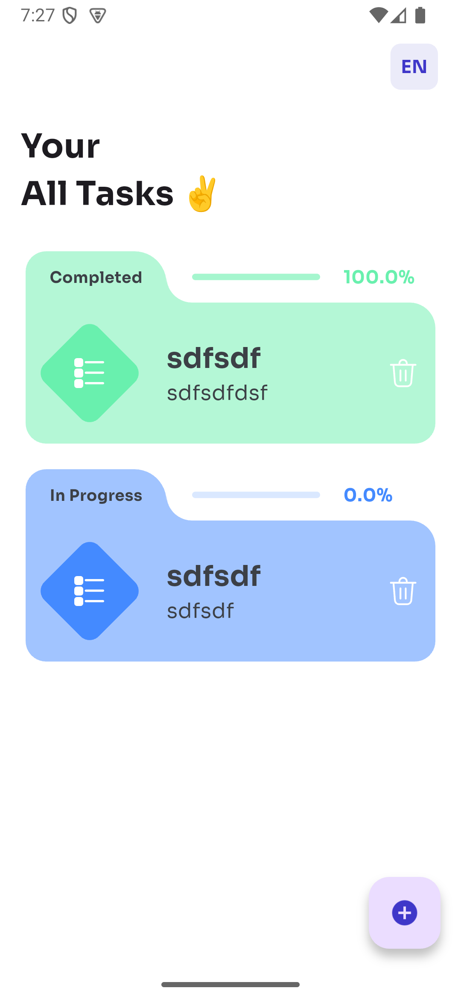
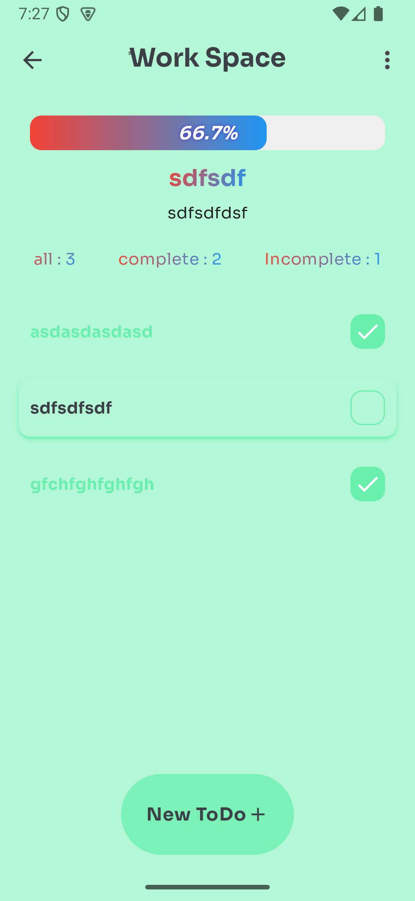

# Daily Task App

## وصف المشروع
**Daily Task App** هو تطبيق لإدارة المهام اليومية، يتيح للمستخدمين إنشاء وإدارة قوائم المهام بطريقة بسيطة وفعّالة. يعتمد التطبيق على معمارية **MVVM** لضمان فصل الكود وسهولة الصيانة، كما يستخدم **Hive** لتخزين البيانات محليًا و**Provider** لإدارة الحالة.

---

## المميزات
- **إضافة المهام**: إمكانية إضافة مهام جديدة مع وصف وأولوية.
- **تحديث المهام**: تعديل تفاصيل المهمة بسهولة.
- **حذف المهام**: إزالة المهام التي تم الانتهاء منها.
- **عرض المهام**: قائمة مرتبة ومصنفة حسب الأولوية أو الحالة.
- **تخزين محلي سريع**: باستخدام قاعدة البيانات **Hive**.
- **إدارة حالة فعّالة**: باستخدام مكتبة **Provider**.

---

## البدء

### المتطلبات
- **Flutter**: الإصدار 3.0 أو أعلى.
- **Dart**: الإصدار 2.18 أو أعلى.
- المكتبات المستخدمة:
  - [Hive](https://pub.dev/packages/hive)
  - [Provider](https://pub.dev/packages/provider)
  - [Flutter Hive Adapter](https://pub.dev/packages/hive_flutter)

### خطوات التشغيل
1. **استنساخ المشروع**:
   ```bash
   git clone https://github.com/username/daily-task-app.git
   cd daily-task-app
   ```

2. **تثبيت الحزم**:
   ```bash
   flutter pub get
   ```

3. **تهيئة Hive**:
   - تأكد من إنشاء مجلد لتخزين البيانات محليًا.
   - أضف التهيئة في ملف `main.dart`.

4. **تشغيل التطبيق**:
   ```bash
   flutter run
   ```

---

## الهيكل الأساسي للمشروع
```plaintext
lib/
├── models/                # النماذج
│   ├── task_model.dart    # نموذج بيانات المهمة
├── views/                 # الشاشات
│   ├── home_screen.dart   # الشاشة الرئيسية
│   ├── add_task_screen.dart # شاشة إضافة مهمة
├── view_models/           # إدارة المنطق والحالة (MVVM)
│   ├── task_view_model.dart
├── services/              # الخدمات المساعدة
│   ├── hive_service.dart  # خدمات Hive لتخزين البيانات
├── main.dart              # نقطة البداية للتطبيق
```

---

## لقطات شاشة
### الشاشة الرئيسية:


### إضافة مهمة جديدة:




---

## المساهمة
نرحب بمساهماتكم لتحسين التطبيق! اتبع الخطوات التالية:
1. **عمل Fork للمشروع**.
2. إنشاء فرع جديد:
   ```bash
   git checkout -b feature/new-feature
   ```
3. إرسال التعديلات:
   ```bash
   git push origin feature/new-feature
   ```
4. إنشاء Pull Request.

---

## الترخيص
هذا المشروع مرخص بموجب ترخيص **MIT License**.

---

## المؤلف
- **اسمك**: [رابط GitHub الخاص بك](https://github.com/username)
- **LinkedIn**: [حسابك على LinkedIn](https://linkedin.com/in/username)

